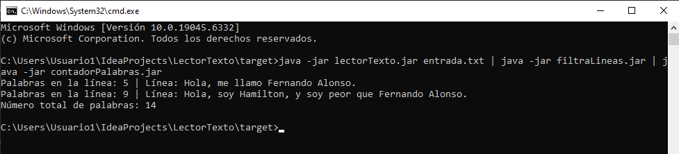

# 📝 Práctica 2 Evaluable

## 📂 Descripción del proyecto
Este proyecto se compone de tres aplicaciones Java independientes que se pueden ejecutar de forma independiente o encadenadas mediante **tuberías** (`|`) para procesar texto.

### 🔹 Aplicaciones:
1. **lectorTexto**
2. **filtraLineas**
3. **contadorPalabras**

El objetivo es:
- Leer un archivo de texto. (Este archivo se puede encontrar en la carpeta resources/entrada.txt del proyecto filtraLineas)
- Filtrar líneas según su longitud.
- Contar el número total de palabras.

## 📁 Enlaces de GitHub
- Parte 1: [lectorTexto](https://github.com/xSurfuel2/LectorTexto.git)
- Parte 2: [filtraLineas](https://github.com/xSurfuel2/filtraLineas.git)
- Parte 3: [contadorPalabras](https://github.com/xSurfuel2/contadorPalabras.git)

## ⚙️ Requisitos
- JDK 8 o superior
- IDE recomendado: NetBeans, Eclipse o IntelliJ
- Terminal de comandos (cmd en Windows, bash en Linux/macOS)

## 🚀 Compilación
Cada proyecto se debe compilar por separado:
```bash
# Compilar lectorTexto
javac -d bin src/org/example/LectorTexto.java

# Compilar filtraLineas
javac -d bin src/org/example/FiltraLineas.java

# Compilar contadorPalabras
javac -d bin src/org/example/ContadorPalabras.java
```
Para crear JAR ejecutables:
```bash
# Crear JARs
Accedemos al pom.xml y añadimos el build justo debajo de la etiqueta properties para que cargue correctamente los plugins necesarios:

<build>
        <finalName>LectorTexto</finalName> //Aquí introducimos el nombre del .jar que deseemos.
        <plugins>
            <plugin>
                <groupId>org.apache.maven.plugins</groupId>
                <artifactId>maven-jar-plugin</artifactId>
                <version>3.4.1</version>
                <configuration>
                    <archive>
                        <manifest>
                            <mainClass>org.example.LectorTexto</mainClass> //Aquí nombramos el paquete.Clase para que acceda correctamente.
                        </manifest>
                    </archive>
                </configuration>
            </plugin>
        </plugins>
    </build>
Lo siguiente es hacer click en el icono de Maven de la derecha, doble click en package y nos crea el .jar en la carpeta target.
```

## 🏃‍♂️ Ejecución independiente
### 1️⃣ lectorTexto
Lee un archivo de texto `entrada.txt` línea por línea.
```bash
java -jar LectorTexto.jar
```
Si el archivo no existe, mostrará un mensaje de error.

### 2️⃣ filtraLineas
Recibe texto de la entrada estándar y filtra solo líneas con más de 20 caracteres.
```bash
java -jar FiltraLineas.jar
```
El programa espera que escribas líneas manualmente o mediante redirección de archivo.

### 3️⃣ contadorPalabras
Cuenta el número total de palabras de la entrada estándar.
```bash
java -jar ContadorPalabras.jar
```
Puedes introducir texto manualmente o mediante redirección.

## 🔗 Ejecución encadenada con tuberías
Para encadenar los tres programas, usa el operador `|`:
```bash
java -jar LectorTexto.jar | java -jar FiltraLineas.jar | java -jar ContadorPalabras.jar
```
### ✅ Flujo de datos
1. `lectorTexto` → Lee el archivo y envía cada línea a la salida estándar.
2. `filtraLineas` → Recibe las líneas y filtra solo aquellas con más de 20 caracteres.
3. `contadorPalabras` → Recibe las líneas filtradas y cuenta el total de palabras.

## 📄 Manual de pruebas
1. Coloca un archivo `entrada.txt` en la misma carpeta que `LectorTexto.jar`.
2. Ejecuta los programas de manera independiente para verificar la funcionalidad de cada uno.
3. Ejecuta la tubería para verificar que los tres programas se conectan correctamente.

Ejemplo de ejecución:
```bash
java -jar LectorTexto.jar
java -jar LectorTexto.jar | java -jar FiltraLineas.jar
java -jar LectorTexto.jar | java -jar FiltraLineas.jar | java -jar ContadorPalabras.jar
```
Capturas de pantalla deben incluir:
- Salida de `lectorTexto`
- Salida de `filtraLineas`
- Salida final de `contadorPalabras`
- Ejecución completa de la tubería

## 📌 Contacto
Para dudas o incidencias:
- GitHub: [xSurfuel2](https://github.com/xSurfuel2)

  ```
## 🎞 Captura y explicación


Para lanzar el programa accedemos a la carpeta donde tenemos los 3 .jar (dentro del proyecto LectorTexto en la carpeta target) y en la ruta escribimos cmd y pulsamos enter para lanzar la consola, usando el código:
- **java -jar lectorTexto.jar entrada.txt | java -jar filtraLineas.jar | java -jar contadorPalabras.jar**
  
Podemos comprobar varias cosas: 
- Que funcione el programa lectorTexto y recoja el texto de nuestro txt.
- Que el programa filtraLineas haga de filtro para poder mostrar sólo las líneas con mas de 20 caracteres. La línea AlonsoFerrari no la muestra porque no pasa el filtro.
- Que el programa contadorPalabras nos muestre el numero de palabras de las líneas de más de 20 caracteres, en este caso 14.
  ```
